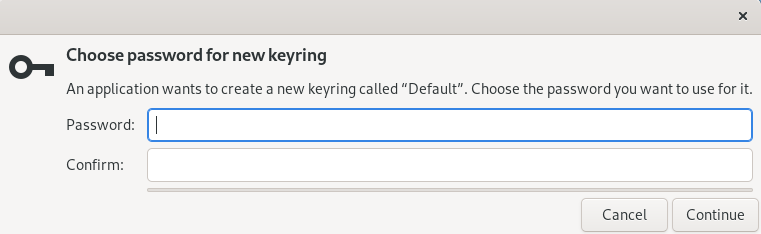

.. _getting-started:

Getting Started
===============

PyDocuShare API allows you to access Collections, Documents and their versions in a DocuShare site in a programmatic way.
You can automate your task or workflow that requires accesses to Xerox DocuShare using this API in Python.

Overview of Typical Workflow
----------------------------

In DocuShare, each docuemnt and object can be identified by a **handle** like Document-00000, Version-000000, Collection-00000. These handles are typically shown as a part of URL when you access your DocuShare site. For example, when you open a Collection in your DocuShare site, the URL in your Web browser should look like:

    https://your.docushare.domain/docushare/dsweb/Get/Document-98765/xxxxx.pdf

"Document-98765" with in this URL is what we call **handle**. This handle is essentially the key to view the properties of the document/collection/version and download the docuemnt file.

Download a document
^^^^^^^^^^^^^^^^^^^

You need to login first to access your DocuShare site:

>>> from docushare import *
>>> ds = DocuShare(base_url='https://your.docushare.domain/docushare/')
>>> ds.login()
_ 
Enter your username for https://your.docushare.domain/docushare/
Username: your_user_name
_ 
Enter password of "your_user_name" for https://your.docushare.domain/docushare/
Password:
_

After successful login, you can access your DocuShare resources through the :py:class:`docushare.DocuShare` instance in the ``ds`` variable. Example below downloads Document-98765:

>>> doc = ds.object('Document-98765')
>>> print(f'Download "{doc.title}" as "{doc.filename}".')
>>> doc.download()
PosixPath('/path/to/your/current/directory/{doc.filename}')

Now the Document-98765 should have been downloaded to your local storage in the shown path.

``ds.object(handle)`` may be replaced by ``ds[handle]`` as shown below:

>>> doc = ds['Document-98765']

Download a specific version
^^^^^^^^^^^^^^^^^^^^^^^^^^^

To download a specific version, you can also specify Version handle:

>>> ver = ds['Version-111111']
>>> print(f'Download "{ver.title}" as "{ver.filename}".')
>>> ver.download()
PosixPath('/path/to/your/current/directory/{ver.filename}')

Accessing version information
^^^^^^^^^^^^^^^^^^^^^^^^^^^^^

You can get the version information as shown below:

>>> doc = ds['Document-98765']
>>> for ver_hdl in doc.version_handles:
...     ver = ds[ver_hdl]
...     print(f'{ver_hdl} is version #{ver.version_number} for {doc.handle}.')

Download all documents in a Collection
^^^^^^^^^^^^^^^^^^^^^^^^^^^^^^^^^^^^^^

The example below shows how you can download all documents in a Collection:

>>> col = ds['Collection-55555']
>>> col.download(destination_path = 'output_dir', option = CollectionDownloadOption.ALL)
[PosixPath('output_dir/dir1/document11.pdf'), PosixPath('output_dir/dir1/document12.pdf'), PosixPath('output_dir/dir2/document21.pdf'), PosixPath('output_dir/dir2/document22.pdf'), PosixPath('output_dir/document01.pdf')]

The :py:meth:`docushare.CollectionObject.download()` method returns the list of paths of successfully downloaded files. It may take some time until the method actually starts downloading if there is a lot of documents in the Collection. It is likely because it takes time to get the properties of each document from your DocuShare site. You may change the log level of PyDocuShare API to INFO so that you can see what is going on behind the scenes:

>>> import logging
>>> ds.logger.setLevel(logging.INFO)
>>> col = ds['Collection-66666']
2022-07-02 14:05:30,998: INFO - HTTP GET  https://your.docushare.domain/docushare/dsweb/Services/Collection-66666
2022-07-02 14:05:30,299: INFO - HTTP GET  https://your.docushare.domain/docushare/dsweb/View/Collection-66666
>>> downloaded_paths = col.download(destination_path = 'output_dir', option = CollectionDownloadOption.ALL, progress_report = False)
2022-07-02 14:05:33,327: INFO - HTTP GET  https://docushare.tmt.org/docushare/dsweb/Services/Collection-77777
2022-07-02 14:05:33,650: INFO - HTTP GET  https://docushare.tmt.org/docushare/dsweb/View/Collection-77777
2022-07-02 14:05:33,654: INFO - HTTP GET  https://your.docushare.domain/docushare/dsweb/Services/Document-10001
2022-07-02 14:05:33,886: INFO - HTTP GET  https://your.docushare.domain/docushare/dsweb/ServicesLib/Document-10001/History
2022-07-02 14:05:34,133: INFO - HTTP GET  https://your.docushare.domain/docushare/dsweb/Services/Document-10002
2022-07-02 14:05:34,313: INFO - HTTP GET  https://your.docushare.domain/docushare/dsweb/ServicesLib/Document-10002/History
2022-07-02 14:05:34,317: INFO - HTTP GET  https://your.docushare.domain/docushare/dsweb/Get/Document-10001
2022-07-02 14:05:34,372: INFO - Started downloading: https://your.docushare.domain/docushare/dsweb/Get/Document-10001 => output_dir/dir1/document1.pdf
2022-07-02 14:05:34,511: INFO - Completed downloading: https://your.docushare.domain/docushare/dsweb/Get/Document-10001 => output_dir/dir1/document1.pdf
2022-07-02 14:05:34,511: INFO - HTTP GET  https://your.docushare.domain/docushare/dsweb/Get/Document-10002
2022-07-02 14:05:34,543: INFO - Started downloading: https://your.docushare.domain/docushare/dsweb/Get/Document-10002 => output_dir/document2.pdf
2022-07-02 14:05:34,892: INFO - Completed downloading: https://your.docushare.domain/docushare/dsweb/Get/Document-10002 => output_dir/document2.pdf

Login DocuShare Site
--------------------

User authentication is one of the key things that PyDocuShare does for you to automate your task. By default, :py:meth:`docushare.DocuShare.login()` asks the user to enter the username and password of the DocuShare site. You can pass the username and password as the arguments so that it will never prompt:

>>> ds.login(username = 'your_use_name', password = 'your_password')

However, it is not desirable to hard-code your password in a Python script. Therefore, it is recommended to store password in your local storage and reuse it in successive logins for task automation. To store the password and use it, call the :py:meth:`docushare.DocuShare.login()` method with `password = PasswordOption.USE_STORED` argument:

>>> ds.login(username = 'your_use_name', password = PasswordOption.USE_STORED)

For the really first time to run the above command, a dialog may pop-up to enter the master password of your `keyring <https://pypi.org/project/keyring/>`_ as shown below:

**The master password of your keyring is DIFFERENT from your DocuShare password.** It is like the master password of your password manager. It is recommended to enter a very strong password, but you also need to remember this password. The master password will be asked when you call :py:meth:`docushare.DocuShare.login()` method with `password = PasswordOption.USE_STORED` argument for the first time after system reboot. But, once you enter the master password, you will not be asked to enter the master password until the system quits.

After that, you may be asked to enter your password on the DocuShare site in the console, so just enter your DocuShare password. If the user authentication is successful, the password is stored in your local storage. So, you do not have to enter your password anymore until the system quits. Try run the same method again:

>>> ds.login(username = 'your_use_name', password = PasswordOption.USE_STORED)

This time it should use the stored DocuShare password and the :py:meth:`docushare.DocuShare.login()` method should return successfully without propmting the password.

Document
--------

TODO: talk about the details of handling Document

Collection
----------

TODO: talk about the details of handling Collection
