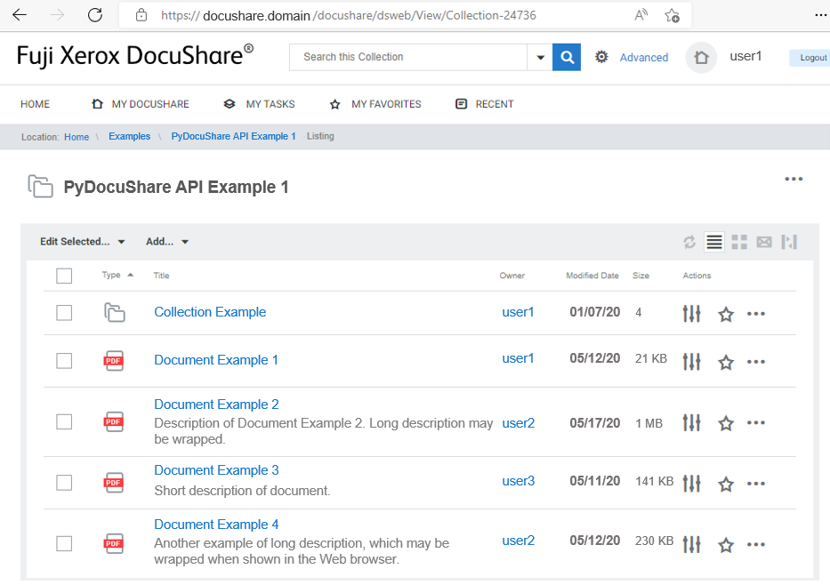

PyDocuShare
===========

This is the top page of documents for PyDocuShare, python API to interact with your Xerox DocuShare site. It is distributed under `GNU General Public License version 2 <https://www.gnu.org/licenses/old-licenses/gpl-2.0.html>`_

           
.. toctree::
   :maxdepth: 2
   :caption: Contents:

   installation
   getting-started
   docushare

Restriction
-----------

This API has been tested with DocuShare version 7.0.0. The implementation of this API does not use DocuShare HTTP/XML interface. It rather parses the same HTML pages as the users see in their Web browsers. Therefore, it may not work with different versions or if the DocuShare configuration is different from what the author assume.

Indices and tables
==================

* :ref:`genindex`
* :ref:`modindex`
* :ref:`search`
